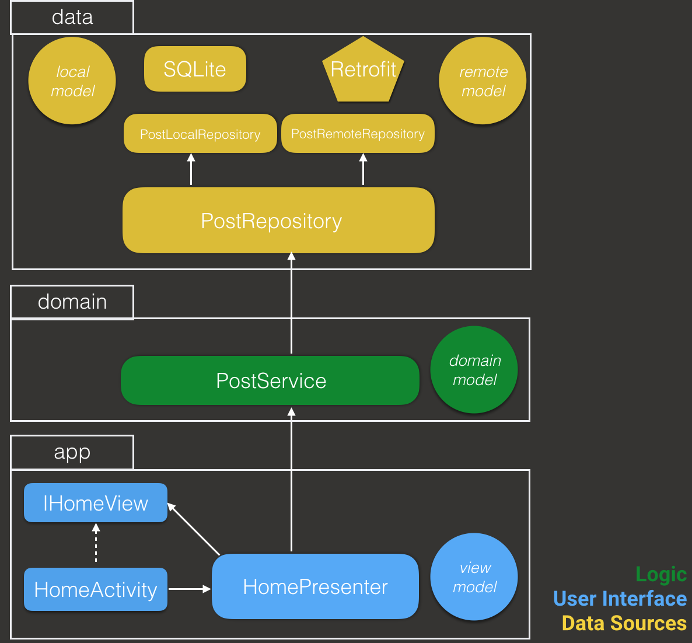

Mono to Clean - Solution 3
============

This repository contains the source code of the solution 3 (clean architecture) used on my talk [Monolithic to Clean][1] where I explain how I evolved from a monolithic
architecture to a clean architecture with RxJava based on [Fernando Cejas Proposal][2] 

[1]: https://speakerdeck.com/fmendes6/from-mono-to-clean
[2]: http://fernandocejas.com/2015/07/18/architecting-android-the-evolution/
